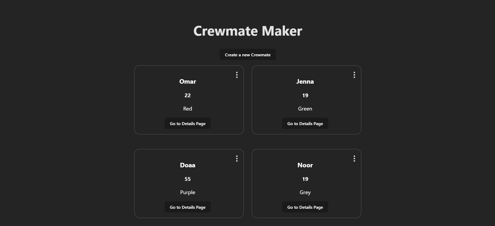

# Project 7: Crewmates

## Description

This project is about setting up a backend using Supabase.

## Required features

- [x] A create form allows users to add new crewmates
  - Users can name the crewmate
  - Users can set the crewmate’s attributes by clicking on one of several values
- [x] The site displays a summary page of all the user’s added crewmates
- [x] A previously created crewmate can be updated from the crewmate list
- [x] A previously created crewmate can be deleted from the crewmate list
- [x] Each crewmate has a direct, unique link to an info page about them

## GIF

