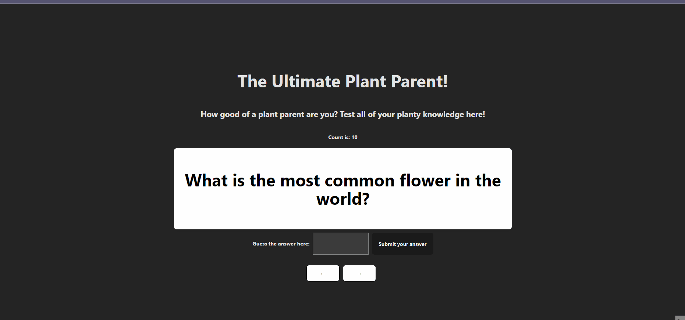

# Project 3: Flashcard

## Description

This project is a simple flashcard application that displays a list of resources and events for flower enthusiasts.

## Required features

- [x] User Input

  - The user can enter their guess in a box before seeing the flipside of the card
  - Clicking on a submit button shows visual feedback about whether the answer was correct or incorrect

- [x] Moving Multiple Ways in the Card List

  - A back button displayed on the card can be used to return to the previous card in a set sequence
  - A next button displayed on the card can be used to navigate to the next card in a set sequence

## GIF

