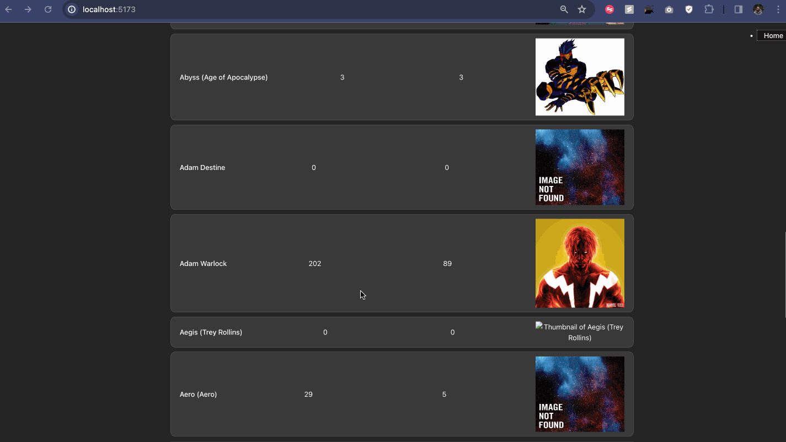

# Project 6: Data Dashboard Part 2

## Description

Data can tell interesting stories. In this two-part project, you will create a data dashboard that provides an at-a-glance summary of information gathered from a public API. In part one, you choose a public API and construct the dashboard view of the project. The dashboard view contains summary statistics and a list view of the data that can be searched and filtered. The dashboard should tell an interesting story about the data and spark the user’s curiosity, inviting them to learn more.

## Required features

- [x] Add Data Visualizations

  - The app includes at least one unique chart developed using the fetched data that tell an interesting story

- [x] Add Links to Detail View
  - Clicking on an item in the list view displays more details about it
  - Each detail view of an item has a direct, unique link to that item’s detail view page

## GIF

