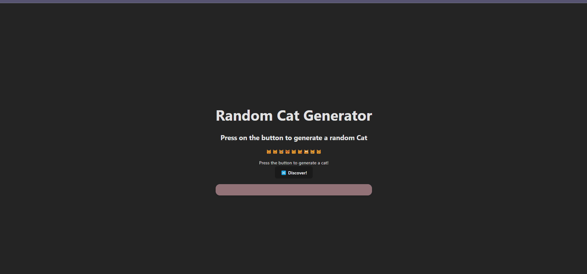

# Project 4: Veni Vici

## Description

This project is a simple API that displays a list of resources and events for showing cats

## Required features

- [x] Clicking a button creates a new API fetch request and displays at least three attributes from the returned JSON data

- [x] Only one item/API call is viewable at a time

- [x] API calls should appear random to the user

- [x] At least one image is displayed per API call

- [x] Clicking on a displayed value for one attribute adds it to a displayed ban list

- [x] Attributes on the ban list prevent further images/API results with that attribute from being displayed

## GIF

